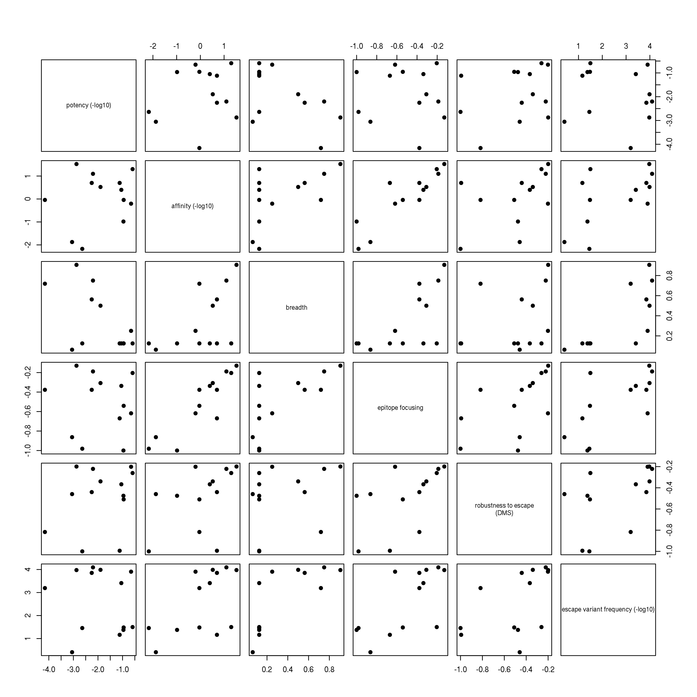
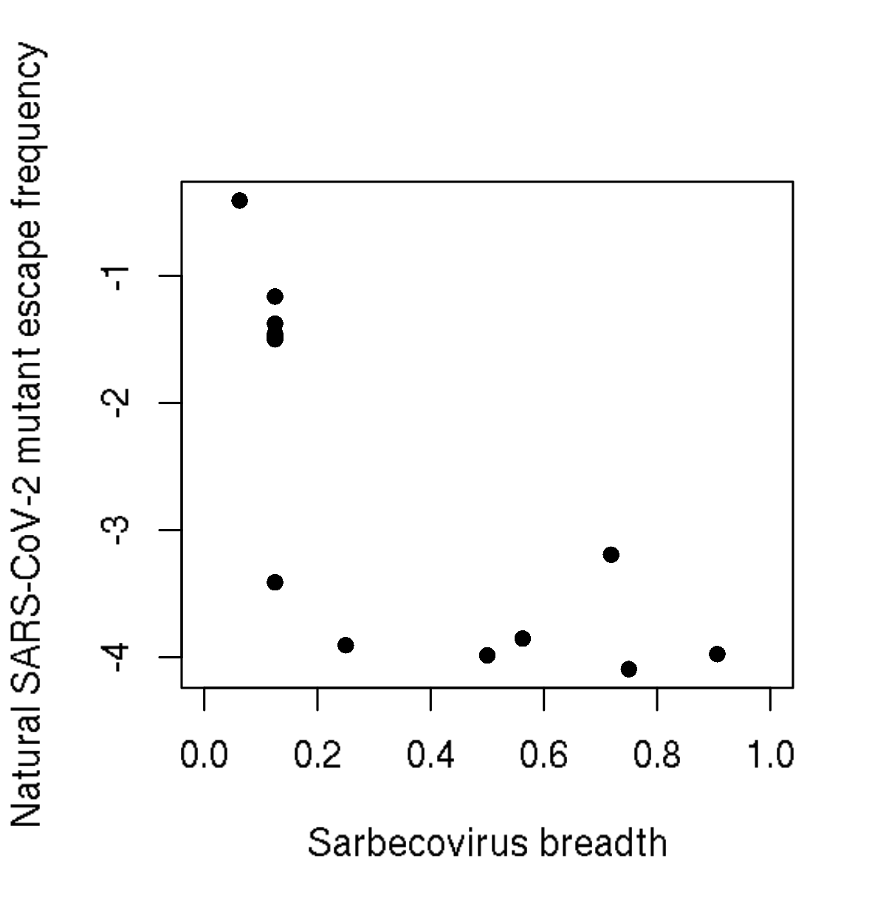
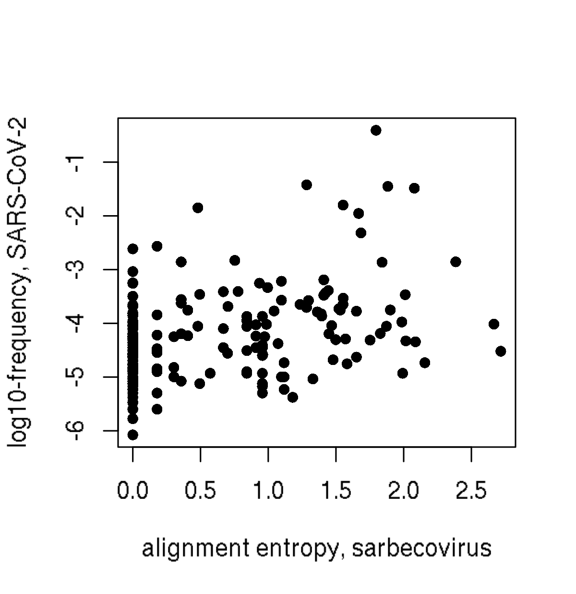
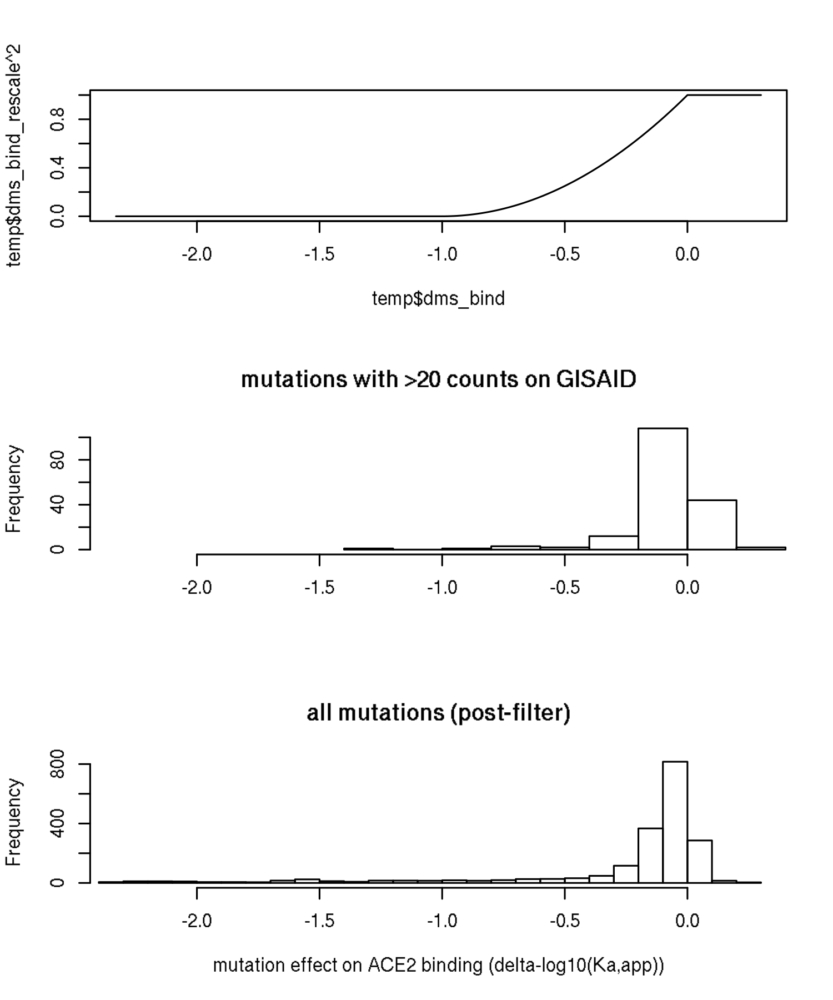
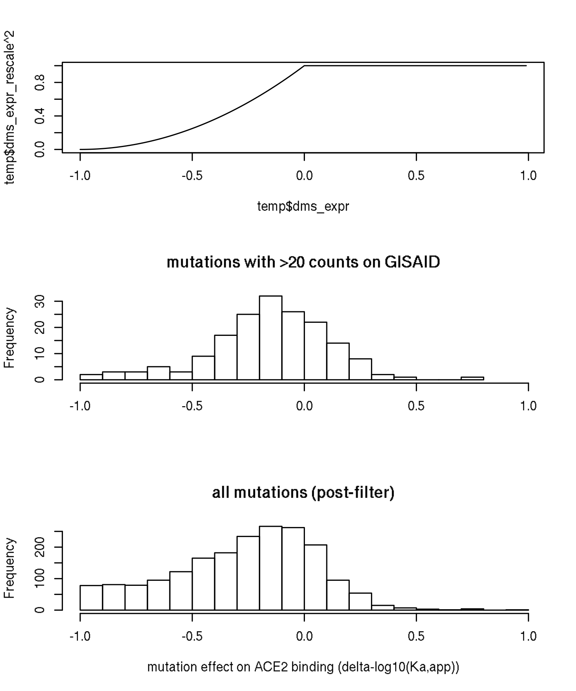

Vir mAbs custom analysis plots
================
Tyler Starr
11/29/2020

-   [Data input and formatting](#data-input-and-formatting)
-   [Part 1: Circulating variants at the per-mut
    level](#part-1-circulating-variants-at-the-per-mut-level)
-   [Part 2: output tables for other
    annotations](#part-2-output-tables-for-other-annotations)
    -   [Per-site annotations table](#per-site-annotations-table)
    -   [Per-antibody annotations
        table](#per-antibody-annotations-table)
-   [Output table for sharing raw data with extra
    context](#output-table-for-sharing-raw-data-with-extra-context)

This notebook does some random analyses on the Vir mAbs panel that vary
from the more constrained global pipeline.

    require("knitr")
    knitr::opts_chunk$set(echo = T)
    knitr::opts_chunk$set(dev.args = list(png = list(type = "cairo")))

    #list of packages to install/load
    packages = c("yaml","data.table","tidyverse","ggrepel","bio3d","RColorBrewer","colourvalues","scales","viridis")
    #install any packages not already installed
    installed_packages <- packages %in% rownames(installed.packages())
    if(any(installed_packages == F)){
      install.packages(packages[!installed_packages])
    }
    #load packages
    invisible(lapply(packages, library, character.only=T))

    #read in config file
    config <- read_yaml("./config.yaml")

    #read in escape profiles file
    profiles_config <- read_yaml(file=config$escape_profiles_config)

    #read in mds profiles file
    mds_config <- read_yaml(file=config$mds_config)

    #make output directory
    output_dir <- config$custom_vir_dir
    if(!file.exists(output_dir)){
      dir.create(file.path(output_dir))
    }

Session info for reproducing environment:

    sessionInfo()

    ## R version 3.6.2 (2019-12-12)
    ## Platform: x86_64-pc-linux-gnu (64-bit)
    ## Running under: Ubuntu 18.04.4 LTS
    ## 
    ## Matrix products: default
    ## BLAS/LAPACK: /app/software/OpenBLAS/0.3.7-GCC-8.3.0/lib/libopenblas_haswellp-r0.3.7.so
    ## 
    ## locale:
    ##  [1] LC_CTYPE=en_US.UTF-8       LC_NUMERIC=C              
    ##  [3] LC_TIME=en_US.UTF-8        LC_COLLATE=en_US.UTF-8    
    ##  [5] LC_MONETARY=en_US.UTF-8    LC_MESSAGES=en_US.UTF-8   
    ##  [7] LC_PAPER=en_US.UTF-8       LC_NAME=C                 
    ##  [9] LC_ADDRESS=C               LC_TELEPHONE=C            
    ## [11] LC_MEASUREMENT=en_US.UTF-8 LC_IDENTIFICATION=C       
    ## 
    ## attached base packages:
    ## [1] stats     graphics  grDevices utils     datasets  methods   base     
    ## 
    ## other attached packages:
    ##  [1] viridis_0.5.1      viridisLite_0.3.0  scales_1.1.0       colourvalues_0.3.7
    ##  [5] RColorBrewer_1.1-2 bio3d_2.4-0        ggrepel_0.8.1      forcats_0.4.0     
    ##  [9] stringr_1.4.0      dplyr_0.8.3        purrr_0.3.3        readr_1.3.1       
    ## [13] tidyr_1.0.0        tibble_3.0.2       ggplot2_3.3.0      tidyverse_1.3.0   
    ## [17] data.table_1.12.8  yaml_2.2.0         knitr_1.26        
    ## 
    ## loaded via a namespace (and not attached):
    ##  [1] tidyselect_1.1.0 xfun_0.11        haven_2.2.0      colorspace_1.4-1
    ##  [5] vctrs_0.3.1      generics_0.0.2   htmltools_0.4.0  rlang_0.4.7     
    ##  [9] pillar_1.4.5     glue_1.3.1       withr_2.1.2      DBI_1.1.0       
    ## [13] dbplyr_1.4.2     modelr_0.1.5     readxl_1.3.1     lifecycle_0.2.0 
    ## [17] munsell_0.5.0    gtable_0.3.0     cellranger_1.1.0 rvest_0.3.5     
    ## [21] evaluate_0.14    parallel_3.6.2   fansi_0.4.0      broom_0.7.0     
    ## [25] Rcpp_1.0.3       backports_1.1.5  jsonlite_1.6     fs_1.3.1        
    ## [29] gridExtra_2.3    hms_0.5.2        digest_0.6.23    stringi_1.4.3   
    ## [33] grid_3.6.2       cli_2.0.0        tools_3.6.2      magrittr_1.5    
    ## [37] crayon_1.3.4     pkgconfig_2.0.3  ellipsis_0.3.0   xml2_1.2.2      
    ## [41] reprex_0.3.0     lubridate_1.7.4  assertthat_0.2.1 rmarkdown_2.0   
    ## [45] httr_1.4.1       rstudioapi_0.10  R6_2.4.1         compiler_3.6.2

Data input and formatting
-------------------------

Read in escape fractions, filter for Vir mAbs.

    dt <- data.table(read.csv(file=config$escape_fracs,stringsAsFactors=F))
    #all mAbs used in plots
    dt <- dt[selection %in% names(mds_config$Vir_antibodies_v_pub$conditions) & library=="average", .(selection,condition,site,protein_site,wildtype,mutation,mut_escape_frac_epistasis_model,site_total_escape_frac_epistasis_model)]

    setnames(dt,"mut_escape_frac_epistasis_model","mut_escape_frac");setnames(dt,"site_total_escape_frac_epistasis_model","site_total_escape")

    dt[,antibody:=as.character(mds_config$Vir_antibodies_v_pub$conditions[condition])]

    dt <- dt[,.(antibody,protein_site,wildtype,mutation,mut_escape_frac,site_total_escape)]
    setnames(dt,"protein_site","site")

    dt[,site_max_escape:=max(mut_escape_frac,na.rm=T),by=c("antibody","site")]

    #read in GISAID alignment
    alignment <- bio3d::read.fasta(file=config$rbd_alignment,rm.dup=F)

Part 1: Circulating variants at the per-mut level
-------------------------------------------------

Current notebook on circulating mutations considers all mutations at a
site together, regardless of the escape conferred by the particular
mutation that is circulating. With the clinical mAbs, in addition to the
sitewise diversity (e.g. as an indicator of what sites can accommodate
diversity), we might be interested in the specific mutations themselves
that are circulating, as that could have a direct effect on antibody
therapies.

We read in table reporting circulating variants. We add new columns to
our data frame indicating the nobs and frequency on GISAID, and the
number of countries in which a mutant has been observed. Then, First,
for each antibody, we plot per-mutation escape fraction versus frequency
(log10), with a ‘pseudo-frequency’ of 0.1x the lowest actual frequency,
to enable log10 plotting)

    #read in table giving mutant counts/frequencies on GISAID
    counts <- read.csv(config$gisaid_mutation_counts,stringsAsFactors=F)
    #add to scores table
    dt[,count:=0];dt[,frequency:=0]
    for(i in 1:nrow(counts)){
      dt[site==counts[i,"site"] & mutation==counts[i,"mutant"],count:=counts[i,"count"]]
      dt[site==counts[i,"site"] & mutation==counts[i,"mutant"],frequency:=counts[i,"frequency"]]
    }

    #make pseudo-count, which is count +1 for all (so 0 can be visualized on log-scales)
    dt[,pseudo_count := count+1]

    #add a 'pseudo-frequency' for visualizaiton of count=0 on log plot (add railroad tracks manually and indicate this is 0). I rewrite this "pseudo-freq" later on to be true count+1 pseudofreq, but this is not as nice for this plot for having separation from the zero for railroad tracks
    dt[,pseudo_frequency:=frequency]
    dt[frequency==0,pseudo_frequency:=0.1*min(dt[frequency>0,frequency])]

    #set antibody as a factor in order of plotting
    dt$antibody <- factor(dt$antibody,levels=mds_config$Vir_antibodies_v_pub$conditions)

    p1 <- ggplot(dt[antibody %in% c("S309","S2H97","S304","S2X35","S2E12","S2X16","S2H58","S2H13","S2D106","S2X58","S2H14","S2X227")])+aes(x=pseudo_frequency,y=mut_escape_frac)+
      geom_point(shape=16, alpha=0.5, size=2.25)+
      facet_wrap(~antibody,nrow=3)+
      scale_x_continuous(trans="log10")+
      scale_y_continuous(limits=c(0,1.05))+
      theme_classic()+
      xlab('mutant frequency on GISAID (log10 scale)')+
      ylab('mutant escape fraction')+
      geom_text_repel(aes(label=ifelse((mut_escape_frac>0.10925 & frequency>1e-6),as.character(paste(wildtype,site,mutation,sep="")),'')),size=3,color="gray40")
    p1

    invisible(dev.print(pdf, paste(output_dir,"/circ-mut-scatterplot.pdf",sep="")))

    #reset "true" pseudofreq for anything downstream
    dt[,pseudo_frequency:=pseudo_count/nrow(alignment$ali)]

    #make pseudo-count, which is count +1 for all (so 0 can be visualized on log-scales)
    dt[,pseudo_count := count+1]

    #add a 'pseudo-frequency' for visualizaiton of count=0 on log plot (add railroad tracks manually and indicate this is 0). I rewrite this "pseudo-freq" later on to be true count+1 pseudofreq, but this is not as nice for this plot for having separation from the zero for railroad tracks
    dt[,pseudo_frequency:=frequency]
    dt[frequency==0,pseudo_frequency:=0.1*min(dt[frequency>0,frequency])]

    p1 <- ggplot(dt[antibody %in% c("S2X259")])+aes(x=pseudo_frequency,y=mut_escape_frac)+
      geom_point(shape=16, alpha=0.5, size=2.25)+
      facet_wrap(~antibody,nrow=1)+
      scale_x_continuous(trans="log10")+
      scale_y_continuous(limits=c(0,1.05))+
      theme_classic()+
      xlab('mutant frequency on GISAID (log10 scale)')+
      ylab('mutant escape fraction')+
      geom_text_repel(aes(label=ifelse((mut_escape_frac>0.10925 & frequency>1e-6),as.character(paste(wildtype,site,mutation,sep="")),'')),size=3,color="gray40")
    p1

    invisible(dev.print(pdf, paste(output_dir,"/circ-mut-scatterplot_s2x259.pdf",sep="")))

    #reset "true" pseudofreq for anything downstream
    dt[,pseudo_frequency:=pseudo_count/nrow(alignment$ali)]

Part 2: output tables for other annotations
-------------------------------------------

Want to annotate logoplots with heatmaps illustrating per-site
quantities, and annotate MDS plots with per-antibody quantities. The
following code assembles these custom tables.

### Per-site annotations table

Want to make a long-form table giving the following quantities for each
RBD site: - Frequency of circulating variants from GISAID (and entropy),
and number of distinct amino acids - Neff from sarbecovirus alignment -
average DMS binding and expression effect at site - structural
information on expected contribution? - indicator of how impacts neut -
ACE2 contact? (For S2E12)

    #read in table giving sites and sarbecovirus alignment entropy (base 2)
    RBD_sites <- data.table(read.csv(file="./data/RBD_sites.csv", stringsAsFactors=F))
    RBD_sites$sarbecovirus_Neff <- 2^RBD_sites$entropy

    for(i in 1:nrow(RBD_sites)){
      RBD_sites$GISAID_total_count[i] <- sum(counts[counts$site==RBD_sites[i,site_SARS2],"count"])
      RBD_sites$GISAID_total_freq[i] <- sum(counts[counts$site==RBD_sites[i,site_SARS2],"frequency"])
      RBD_sites$GISAID_number_amino_acids[i] <- length(counts[counts$site==RBD_sites[i,site_SARS2],"frequency"])+1 #b/c wt always observed
    }

    #add pseudocount to count for count=0
    RBD_sites[,GISAID_total_pseudocount := GISAID_total_count+1]

    #take freq and log10 from pseudocounted
    RBD_sites[,GISAID_total_pseudofreq := GISAID_total_pseudocount/nrow(alignment$ali)]
    RBD_sites$GISAID_log10_pseudofreq <- log10(RBD_sites$GISAID_total_pseudofreq)

    setnames(RBD_sites,"site_SARS2","site")

    #calc gisaid alignment entropy
    entropy <- entropy(alignment)$H
    RBD_sites$GISAID_entropy <- entropy

    #load prior dms data
    dms <- data.table(read.csv(file=config$mut_bind_expr,stringsAsFactors=F));dms[,mutation:=NULL]
    setnames(dms,"site_SARS2","site");setnames(dms,"mutant","mutation");setnames(dms,"bind_avg","dms_bind");setnames(dms,"expr_avg","dms_expr")

    #annotate mean bind and expr effect of mut at each site
    for(i in 1:nrow(RBD_sites)){
      RBD_sites[i,"dms_mean_bind"] <- mean(dms[site==RBD_sites[i,site] & wildtype!=mutation & mutation!="*",dms_bind],na.rm=T)
      RBD_sites[i,"dms_mean_expr"] <- mean(dms[site==RBD_sites[i,site] & wildtype!=mutation & mutation!="*",dms_expr],na.rm=T)
    }

    #save data, for now, in the custom Vir_annotations input data directory
    write.csv(RBD_sites,file=config$vir_annotations_logo_input,row.names=F)

### Per-antibody annotations table

Want to make a long-form table giving the following quantities for each
antibody site: - summary metrics of ‘escapability’ - summary metrics of
‘breadth’ - metrics of potency

I started with the potency information reported in the table provided by
Vir, and a measurement of breadth calculated from the homolog mapping.
This breadth metric gives a fractional breadth metric for each clade,
and then takes the average of the four clades breadth. This is to
reweight clades by the number of RBDs known – that is, if an antibody
binds 3 of the 4 SARS2 clade, all the SARS1 clade (8 isolates,
collapsing human, civet SARS1), none of the Af/Eur (2), and none of the
non-ACE2-deletions clade (21), its breadth would be (3/4+8/8+0/2+0/21)/4
= 0.4375. Below, I load in this table and add in some metrics of
escapability.

    antibody_annotations <- data.table(read.csv(file=config$vir_annotations_input))

    #compute escapabilities separately for the Crowe CH&M mAbs and the REGN+LY+Vir+AZ Crowe mAbs, as there were some procedural differences in these first experiments versus the later ones that would impact relative escapabilities. Probably going to just "NA" out the group 2 escapabilities (original COV2 set)
    dt[,group:=2]
    dt[antibody %in% c("S2D106","S2E12","S2H58","S2X16","S2X227","S2X35","S2X58","S304","S309","S2H97","S2H13","S2H14","S2X259","LY-CoV016","LY-CoV555","REGN10987","REGN10933","COV2-2196","COV2-2130"),group:=1]

    dt[,mut_escape_frac_norm_mode := mut_escape_frac/max(mut_escape_frac,na.rm=T),by="antibody"]

    #Compute escapability as sum of muts above 5x global median escape across antibodies in group. Normalize to highest escape fraction of a mutation for that antibody (e.g. S2H97 has smaller total escape fraction, perhaps because its mutations reduce RBD expression which limits max theoretical escape fraction)
    median_cutoff<-5
    cutoff1 <- median_cutoff*median(dt[antibody %in% c("S2D106","S2E12","S2H58","S2X16","S2X227","S2X35","S2X58","S304","S309","S2H97","S2H13","S2H14","S2X259"),mut_escape_frac])
    cutoff2 <- median_cutoff*median(dt[group==2,mut_escape_frac])
    dt[,mut_5x_all_censored:=1]

    dt[group==1 & mut_escape_frac < cutoff1,mut_5x_all_censored:=0]
    dt[group==2 & mut_escape_frac < cutoff2,mut_5x_all_censored:=0]
    dt[,antibody_escapability:=sum(mut_5x_all_censored*mut_escape_frac_norm_mode),by="antibody"]
    dt[group==2,antibody_escapability:=NA]

    unique(dt[,.(antibody,antibody_escapability)])

    ##      antibody antibody_escapability
    ##  1: LY-CoV016             120.75501
    ##  2: COV2-2050                    NA
    ##  3: COV2-2082                    NA
    ##  4: COV2-2094                    NA
    ##  5: COV2-2096                    NA
    ##  6: COV2-2130              65.61370
    ##  7: COV2-2165                    NA
    ##  8: COV2-2196              41.32740
    ##  9: COV2-2479                    NA
    ## 10: COV2-2499                    NA
    ## 11: COV2-2677                    NA
    ## 12: COV2-2832                    NA
    ## 13:    CR3022                    NA
    ## 14: LY-CoV555              59.91395
    ## 15: REGN10933              58.12083
    ## 16: REGN10987              93.34850
    ## 17:    S2D106              22.36790
    ## 18:     S2E12              67.64950
    ## 19:     S2H13             107.40290
    ## 20:     S2H14              94.45570
    ## 21:     S2H58              59.23930
    ## 22:     S2H97              14.16382
    ## 23:     S2X16             109.46830
    ## 24:    S2X227              36.86396
    ## 25:    S2X259              20.63480
    ## 26:     S2X35              41.26580
    ## 27:     S2X58              73.31269
    ## 28:      S304              41.24491
    ## 29:      S309              33.66290
    ##      antibody antibody_escapability

    #next, let's add factor weights for ACE2 binding and RBD expression. We'll take the DMS scores, and rescale them to be from 0 to 1, and make each of these additional multiplicative factors for the per-mut score that is summed (along with the >5x median factor)

    dt <- merge(dt,dms[,.(site,wildtype,mutation,dms_bind,dms_expr)],sort=F)
    #rescale 0 to 1, where any score <-1 is set to 0, and linear scale to value 1 for dms scores >=0
    dt[,dms_bind_rescale := (dms_bind - -1)/(0 - -1)]
    dt[dms_bind_rescale>1,dms_bind_rescale:=1];dt[dms_bind_rescale<0,dms_bind_rescale:=0]
    dt[,dms_expr_rescale := (dms_expr - -1)/(0 - -1)]
    dt[dms_expr_rescale>1,dms_expr_rescale:=1];dt[dms_expr_rescale<0,dms_expr_rescale:=0]

    #compute function-weighted escapability, squaring the tolerance expression values (heightens penalization)
    dt[,antibody_escapability_tolerance_weighted:=sum(mut_5x_all_censored*dms_bind_rescale^2*dms_expr_rescale^2*mut_escape_frac_norm_mode),by="antibody"]
    dt[group==2,antibody_escapability_tolerance_weighted:=NA]
    unique(dt[,.(antibody,antibody_escapability_tolerance_weighted)])

    ##      antibody antibody_escapability_tolerance_weighted
    ##  1: LY-CoV016                                25.624022
    ##  2: COV2-2050                                       NA
    ##  3: COV2-2082                                       NA
    ##  4: COV2-2094                                       NA
    ##  5: COV2-2096                                       NA
    ##  6: COV2-2130                                24.059521
    ##  7: COV2-2165                                       NA
    ##  8: COV2-2196                                 3.293887
    ##  9: COV2-2479                                       NA
    ## 10: COV2-2499                                       NA
    ## 11: COV2-2677                                       NA
    ## 12: COV2-2832                                       NA
    ## 13:    CR3022                                       NA
    ## 14: LY-CoV555                                29.205106
    ## 15: REGN10933                                 8.699570
    ## 16: REGN10987                                28.835994
    ## 17:    S2D106                                 8.326607
    ## 18:     S2E12                                 6.434131
    ## 19:     S2H13                                31.951911
    ## 20:     S2H14                                14.679108
    ## 21:     S2H58                                16.277460
    ## 22:     S2H97                                 6.364128
    ## 23:     S2X16                                15.184502
    ## 24:    S2X227                                11.724272
    ## 25:    S2X259                                 7.072392
    ## 26:     S2X35                                14.079611
    ## 27:     S2X58                                31.758466
    ## 28:      S304                                26.109599
    ## 29:      S309                                10.850049
    ##      antibody antibody_escapability_tolerance_weighted

    #natural variation weighted escapability -- have a simpler metric I compute below
    # dt[,log10_freq:=log10(pseudo_frequency)]
    # dt[,log10_freq_rescale := (log10_freq-min(log10_freq))/(max(log10_freq)-min(log10_freq))]
    # dt[,antibody_escapability_natural_variation_weighted:=sum(mut_5x_all_censored*log10_freq_rescale*mut_escape_frac),by="antibody"]
    # dt[group==2,antibody_escapability_natural_variation_weighted:=NA]
    # unique(dt[,.(antibody,antibody_escapability_natural_variation_weighted)])

    #compute robustness to natural variation as a simple sum of frequencies of 'strong escape' mutations
    dt[,antibody_escapability_natural_variants:=sum(frequency*mut_5x_all_censored),by="antibody"]
    dt[group==2,antibody_escapability_natural_variants:=NA]
    unique(dt[,.(antibody,antibody_escapability_natural_variants)])

    ##      antibody antibody_escapability_natural_variants
    ##  1: LY-CoV016                           4.731433e-03
    ##  2: COV2-2050                                     NA
    ##  3: COV2-2082                                     NA
    ##  4: COV2-2094                                     NA
    ##  5: COV2-2096                                     NA
    ##  6: COV2-2130                           2.679142e-04
    ##  7: COV2-2165                                     NA
    ##  8: COV2-2196                           2.232618e-05
    ##  9: COV2-2479                                     NA
    ## 10: COV2-2499                                     NA
    ## 11: COV2-2677                                     NA
    ## 12: COV2-2832                                     NA
    ## 13:    CR3022                                     NA
    ## 14: LY-CoV555                           2.810351e-02
    ## 15: REGN10933                           2.124422e-03
    ## 16: REGN10987                           1.088831e-03
    ## 17:    S2D106                           8.252100e-03
    ## 18:     S2E12                           6.182635e-05
    ## 19:     S2H13                           9.488627e-03
    ## 20:     S2H14                           2.061686e-01
    ## 21:     S2H58                           8.628211e-03
    ## 22:     S2H97                           5.667415e-05
    ## 23:     S2X16                           1.258510e-02
    ## 24:    S2X227                           3.932843e-04
    ## 25:    S2X259                           6.182635e-05
    ## 26:     S2X35                           8.071774e-05
    ## 27:     S2X58                           2.544670e-02
    ## 28:      S304                           5.787633e-04
    ## 29:      S309                           1.099135e-04
    ##      antibody antibody_escapability_natural_variants

    # unique(dt[,.(antibody,antibody_escapability,antibody_escapability_tolerance_weighted,antibody_escapability_natural_variation_weighted,group)])

    #merge into antibody_annotations table
    antibody_annotations <- rbind(antibody_annotations,data.table::melt(unique(dt[,.(antibody,antibody_escapability,antibody_escapability_tolerance_weighted,antibody_escapability_natural_variants,group)]),
                     id.vars=c("antibody"),
                     measure.vars=c("antibody_escapability","antibody_escapability_tolerance_weighted","antibody_escapability_natural_variants","group"),
                     variable.name="metric",value.name="value"))

    antibody_annotations <- dcast(antibody_annotations, antibody~metric)

    #rescale escapabilities 0 to 1 among just the Vir mAbs (though none actually zero, set zero to be literally zero)
    antibody_annotations[,antibody_escapability_rescale:=antibody_escapability]
    antibody_annotations[,antibody_escapability_tolerance_weighted_rescale:=antibody_escapability_tolerance_weighted]
    antibody_annotations[!(antibody %in% c("S2E12","S2X58","S2H58","S2D106","S2X227","S2X16","S304","S309","S2X35","S2X259","S2H97","S2H13","S2H14")),c("antibody_escapability_rescale","antibody_escapability_tolerance_weighted_rescale"):=NA]
    antibody_annotations$antibody_escapability_rescale <- rescale(antibody_annotations$antibody_escapability_rescale,to=c(0,1),from=c(0,max(antibody_annotations$antibody_escapability_rescale,na.rm=T)))
    antibody_annotations$antibody_escapability_tolerance_weighted_rescale <- rescale(antibody_annotations$antibody_escapability_tolerance_weighted_rescale,to=c(0,1),from=c(0,max(antibody_annotations$antibody_escapability_tolerance_weighted_rescale,na.rm=T)))

    #write table
    write.csv(antibody_annotations,file=paste(output_dir,"/antibody_annotations.csv",sep=""),row.names=F)

To use this antibody\_annotations file for coloring MDS plots, we need
to convert to wide form, rescale all to be relative values 0 to 1 (where
1 is the “strongest” for each – aka, the most potent, the highest
breadth, the least escapable) convert from values to the desired
plotting color (can use \#xxxxxx hexadecimal nomenclature), and add in
the other mAbs in the MDS plot layout with some white/missing color for
now (can add these to these calculations later)

    #put IC50s and affinities on log10 scale
    antibody_annotations$MLV_IC50_logscale <- log10(antibody_annotations$MLV_IC50)
    antibody_annotations$VSV_IC50_logscale <- log10(antibody_annotations$VSV_IC50)
    antibody_annotations$SARS2_IC50_logscale <- log10(antibody_annotations$SARS2_IC50)
    antibody_annotations$Zost_IC50_logscale <- log10(antibody_annotations$Zost_IC50)
    antibody_annotations$RBD_SPR_nM_logscale <- log10(antibody_annotations$RBD_SPR_nM)

    #put the natural variation of escape muts on log10 scale
    antibody_annotations$antibody_escapability_natural_variants_logscale <- log10(antibody_annotations$antibody_escapability_natural_variants)

    #make joint potency column that combines SARS2 for group 1 and Zost for group 2 (plus COV2-2196 and 2130) -- both live virus but of course different labs, so perhaps a grain of salt
    antibody_annotations$neuts_combined <- as.numeric(NA)
    antibody_annotations[group==1,neuts_combined:=SARS2_IC50_logscale]
    antibody_annotations[group==2 | antibody %in% c("COV2-2130","COV2-2196"),neuts_combined:=Zost_IC50_logscale]

    #rescale each to c(0,1) or (1,0) depending which min/max should be "blue"
    #IC50s and Kd: lower value is "blue"
    antibody_annotations$MLV_IC50_scale <- rescale(antibody_annotations$MLV_IC50_logscale,to=c(0,1))
    antibody_annotations$VSV_IC50_scale <- rescale(antibody_annotations$VSV_IC50_logscale,to=c(0,1))
    antibody_annotations$SARS2_IC50_scale <- rescale(antibody_annotations$SARS2_IC50_logscale,to=c(0,1))
    antibody_annotations$Zost_IC50_scale <- rescale(antibody_annotations$Zost_IC50_logscale,to=c(0,1))
    antibody_annotations$neuts_combined_scale <- rescale(antibody_annotations$neuts_combined,to=c(0,1))
    antibody_annotations$RBD_SPR_nM_scale <- rescale(antibody_annotations$RBD_SPR_nM_logscale,to=c(0,1))

    antibody_annotations$MLV_IC50_color <- color_values(antibody_annotations$MLV_IC50_scale,palette="viridis",include_alpha=F,na_colour="#FFFFFF")
    antibody_annotations$VSV_IC50_color <- color_values(antibody_annotations$VSV_IC50_scale,palette="viridis",include_alpha=F,na_colour="#FFFFFF")
    antibody_annotations$SARS2_IC50_color <- color_values(antibody_annotations$SARS2_IC50_scale,palette="viridis",include_alpha=F,na_colour="#FFFFFF")
    antibody_annotations$Zost_IC50_color <- color_values(antibody_annotations$Zost_IC50_scale,palette="viridis",include_alpha=F,na_colour="#FFFFFF")
    antibody_annotations$neuts_combined_color <- color_values(antibody_annotations$neuts_combined_scale,palette="viridis",include_alpha=F,na_colour="#FFFFFF")
    antibody_annotations$RBD_SPR_nM_color <- color_values(antibody_annotations$RBD_SPR_nM_scale,palette="viridis",include_alpha=F,na_colour="#FFFFFF")

    #breadth, higher value is "blue"
    antibody_annotations$breadth_scale <- rescale(antibody_annotations$breadth,to=c(1,0))

    antibody_annotations$breadth_color <- color_values(antibody_annotations$breadth_scale,palette="viridis",include_alpha=F,na_colour="#FFFFFF")

    #escapability metrics, lower values are blue, and do separately by group (COV2 set currently set to NA anyway)
    antibody_annotations$antibody_escapability_scale <- as.numeric(NA)
    antibody_annotations$antibody_escapability_tolerance_weighted_scale <- as.numeric(NA)
    antibody_annotations$antibody_escapability_natural_variants_scale <- as.numeric(NA)

    antibody_annotations[group==1,"antibody_escapability_scale"] <- rescale(antibody_annotations[group==1,antibody_escapability],to=c(0,1))
    antibody_annotations[group==2,"antibody_escapability_scale"] <- rescale(antibody_annotations[group==2,antibody_escapability],to=c(0,1))

    ## Warning in min(x): no non-missing arguments to min; returning Inf

    ## Warning in max(x): no non-missing arguments to max; returning -Inf

    antibody_annotations[group==1,"antibody_escapability_tolerance_weighted_scale"] <- rescale(antibody_annotations[group==1,antibody_escapability_tolerance_weighted],to=c(0,1))
    antibody_annotations[group==2,"antibody_escapability_tolerance_weighted_scale"] <- rescale(antibody_annotations[group==2,antibody_escapability_tolerance_weighted],to=c(0,1))

    ## Warning in min(x): no non-missing arguments to min; returning Inf

    ## Warning in min(x): no non-missing arguments to max; returning -Inf

    antibody_annotations[group==1,"antibody_escapability_natural_variants_scale"] <- rescale(antibody_annotations[group==1,antibody_escapability_natural_variants_logscale],to=c(0,1))
    antibody_annotations[group==2,"antibody_escapability_natural_variants_scale"] <- rescale(antibody_annotations[group==2,antibody_escapability_natural_variants_logscale],to=c(0,1))

    ## Warning in min(x): no non-missing arguments to min; returning Inf

    ## Warning in min(x): no non-missing arguments to max; returning -Inf

    antibody_annotations$antibody_escapability_color <- color_values(antibody_annotations$antibody_escapability_scale,palette="viridis",include_alpha=F,na_colour="#FFFFFF")
    antibody_annotations$antibody_escapability_tolerance_weighted_color <- color_values(antibody_annotations$antibody_escapability_tolerance_weighted_scale,palette="viridis",include_alpha=F,na_colour="#FFFFFF")
    antibody_annotations$antibody_escapability_natural_variants_color <- color_values(antibody_annotations$antibody_escapability_natural_variants_scale,palette="viridis",include_alpha=F,na_colour="#FFFFFF")

    #rename antibody to condition for mds plotting table
    setnames(antibody_annotations,"antibody","condition")

    write.csv(antibody_annotations,file=config$vir_annotations_mds_input,row.names=F,quote=F)

Plot each metric versus the other in the antibody annotations table.

First, among the different potency metrics.

    pairs(antibody_annotations[,.(SARS2_IC50_logscale,MLV_IC50_logscale,VSV_IC50_logscale)], main="",pch=19)

    invisible(dev.print(pdf, paste(output_dir,"/correlations_antibody-properties_neut-potencies.pdf",sep=""),useDingbats=F))

    pairs(antibody_annotations[condition %in% c("S2E12","S2X58","S2H58","S2D106","S2X227","S2X16","S304","S309","S2X35","S2X259","S2H97","S2H13","S2H14"), .(-SARS2_IC50_logscale,-RBD_SPR_nM_logscale,breadth,-antibody_escapability_rescale,-antibody_escapability_tolerance_weighted_rescale,-antibody_escapability_natural_variants_logscale)], main="",pch=19,labels=c("potency (-log10)","affinity (-log10)","breadth","epitope focusing","robustness to escape\n(DMS)","escape variant frequency (-log10)"))

    invisible(dev.print(pdf, paste(output_dir,"/correlations_antibody-properties_all.pdf",sep=""),useDingbats=F))

Specific scatterplots for main text renderings – breadth versus potency
(two color sclaes for two datasets), raw escapability versus SPR
affinity

    plot(antibody_annotations$SARS2_IC50_logscale,antibody_annotations$breadth,pch=16,ylim=c(0,1),ylab="relative sarbecovirus breadth",xlab="neutralizing potency (live virus IC50, log10 scale)")

    #points(antibody_annotations$Zost_IC50_logscale,antibody_annotations$breadth,pch=16,col="gray70")

    invisible(dev.print(pdf, paste(output_dir,"/scatter_breadth-v-potency.pdf",sep=""),useDingbats=F))

    plot(antibody_annotations$RBD_SPR_nM_logscale,antibody_annotations$antibody_escapability_rescale,pch=16,ylab="relative epitope size (a.u.)",xlab="Fab:RBD binding affinity (nM, log10 scale)",ylim=c(0,1))
    legend("topleft",bty="n",cex=1,legend=paste("R2:",format(summary(lm(antibody_annotations$antibody_escapability ~ antibody_annotations$RBD_SPR_nM_logscale))$r.squared,digits=3)))

    invisible(dev.print(pdf, paste(output_dir,"/scatter_escapability-v-affinity.pdf",sep=""),useDingbats=F))

    plot(antibody_annotations[condition %in% c("S2E12","S2X58","S2H58","S2D106","S2X227","S2X16","S304","S309","S2X35","S2X259","S2H97","S2H13","S2H14"),breadth], antibody_annotations[condition %in% c("S2E12","S2X58","S2H58","S2D106","S2X227","S2X16","S304","S309","S2X35","S2X259","S2H97","S2H13","S2H14"),antibody_escapability_natural_variants_logscale] ,pch=16,ylab="Natural SARS-CoV-2 mutant escape frequency",xlab="Sarbecovirus breadth",xlim=c(0,1))

    invisible(dev.print(pdf, paste(output_dir,"/scatter_natural-variantescapability-v-breadth.pdf",sep=""),useDingbats=F))

    plot(antibody_annotations$SARS2_IC50_logscale,antibody_annotations$VSV_IC50_logscale,pch=16,xlab="neut IC50, SARS2 (ng/mL, log10 scale)",ylab="neut IC50, VSV pp (ng/mL, log10 scale)")
    legend("topleft",bty="n",cex=1,legend=paste("R2:",format(summary(lm(antibody_annotations$VSV_IC50_logscale ~ antibody_annotations$SARS2_IC50_logscale))$r.squared,digits=3),"\nslope:",format(summary(lm(antibody_annotations$VSV_IC50_logscale ~ antibody_annotations$SARS2_IC50_logscale))$coefficients["antibody_annotations$SARS2_IC50_logscale","Estimate"],digits=3)))

    invisible(dev.print(pdf, paste(output_dir,"/scatter_VSV-SARS2-correlation.pdf",sep=""),useDingbats=F))

Analysis of MARMS mutants. First, how does number of different muts
selected relate to our escapability metric?

    plot(antibody_annotations$antibody_escapability_tolerance_weighted_rescale,antibody_annotations$number_MARMS,pch=16,xlab="antibody escapability",ylab="number unique MARMS mutants",ylim=c(0,13),xlim=c(0,1))
    legend("topleft",bty="n",cex=1,legend=paste("R2:",format(summary(lm(antibody_annotations$number_MARMS ~ antibody_annotations$antibody_escapability_tolerance_weighted_rescale))$r.squared,digits=3)))

    invisible(dev.print(pdf, paste(output_dir,"/scatter_MARMS-v-escapability-correlation.pdf",sep=""),useDingbats=F))

Can we see concordance between rates of sarbecovirus evolution and
SARS-CoV-2 variation?

    plot(RBD_sites$entropy, RBD_sites$GISAID_log10_pseudofreq,pch=16,xlab="alignment entropy, sarbecovirus",ylab="log10-frequency, SARS-CoV-2")

    #legend("topleft",bty="n",cex=1,legend=paste("R2:",format(summary(lm(antibody_annotations$number_MARMS ~ antibody_annotations$antibody_escapability_tolerance_weighted_rescale))$r.squared,digits=3)))

    invisible(dev.print(pdf, paste(output_dir,"/scatter_sarbecovirus-v-SARS2-variation-correlation.pdf",sep=""),useDingbats=F))

Want a plot showing the application of the ACE2 binding and RBD
expression penalizations w.r.t. escapability. First, start with a 2D
scatter showing mutation effect on RBD expression versus ACE2 binding,
colored by GISAID frequency?

    par(mfrow=c(3,1))

    temp <- dt[antibody=="S2E12",]
    temp <- temp[order(temp$dms_bind),]

    #plot showing decay function for the multiplier for escapability
    plot(temp$dms_bind, temp$dms_bind_rescale^2, type="l")

    #plot showing binding effect for mutations present with at least 10 counts on GISAID
    hist(dt[antibody=="S2E12" & count > 20, dms_bind],xlim=range(dt$dms_bind,na.rm=T),breaks=10,xlab=NULL,main="mutations with >20 counts on GISAID")

    #plot showing binding effects of all muts above censored threshold
    hist(dt[antibody=="S2E12",dms_bind],xlim=range(dt$dms_bind,na.rm=T),breaks=20, xlab = "mutation effect on ACE2 binding (delta-log10(Ka,app))",main="all mutations (post-filter)")

    invisible(dev.print(pdf, paste(output_dir,"/illustration_binding_penalty.pdf",sep=""),useDingbats=F))

    par(mfrow=c(3,1))

    temp <- dt[antibody=="S2E12",]
    temp <- temp[order(temp$dms_expr),]

    #plot showing decay function for the multiplier for escapability
    plot(temp$dms_expr, temp$dms_expr_rescale^2, type="l")

    #plot showing binding effect for mutations present with at least 10 counts on GISAID
    hist(dt[antibody=="S2E12" & count > 20, dms_expr],xlim=range(dt$dms_expr,na.rm=T),breaks=15,xlab=NULL,main="mutations with >20 counts on GISAID")

    #plot showing binding effects of all muts above censored threshold
    hist(dt[antibody=="S2E12",dms_expr],xlim=range(dt$dms_expr,na.rm=T),breaks=20, xlab = "mutation effect on ACE2 binding (delta-log10(Ka,app))",main="all mutations (post-filter)")

    invisible(dev.print(pdf, paste(output_dir,"/illustration_expression_penalty.pdf",sep=""),useDingbats=F))

Output table for sharing raw data with extra context
----------------------------------------------------

    #setnames(dt,"count","GISAID_count")
    #setnames(dt,"frequency","GISAID_frequency")
    #write.csv(dt,file=paste(output_dir,"/Vir_escape_raw_data.csv",sep=""))
